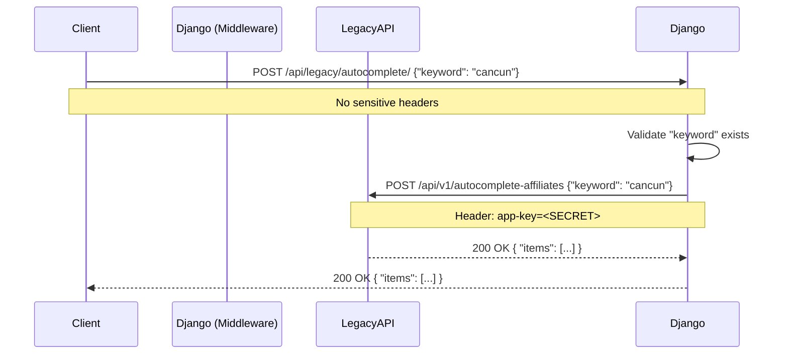

# Design: Legacy API Middleware

## Architecture

The `legacy_middleware` Django app serves as a Backend-for-Frontend (BFF) layer for the new SSG frontend. Its primary responsibility is to proxy requests to the legacy Laravel API while injecting sensitive credentials (like `app-key` or tokens) that should not be exposed to the browser.

### Autocomplete Flow

## Security Considerations

- **Secrets Management**: The `app-key` is stored in environment variables (`LEGACY_API_KEY`) and accessed via `django.conf.settings`. It is never serialized in the response to the client.
- **Input Validation**: The middleware provides a first line of defense by validating inputs (e.g., checking for `keyword`) before forwarding.
- **CORS**: Standard Django CORS settings apply to this endpoint, allowing only trusted origins (the SSG frontend) to access it.

## Error Handling

- **Upstream Errors**: If the Legacy API times out or errors, the Django middleware wraps this in a generic error response (e.g., 502 Bad Gateway) to avoid exposing stack traces or internal URL structures of the legacy system, while still providing necessary feedback if it's a validation error (e.g. 422).

## Implementation Details

- **Service Layer**: A simple service function `fetch_legacy_autocomplete(keyword: str)` will handle the `requests` logic.
- **View Layer**: A functional view or `APIView` (DRF) will handle the HTTP request/response cycle. Using DRF is preferred for consistency with the rest of the project.
